# Proyección de Escalabilidad Financiera: ProxiAlert 📈💰

Esta proyección estima el comportamiento de **Ingresos (Ads + Premium)** frente a **Costos (Google API)** según el volumen de usuarios activos mensuales (MAU).

## 📊 Matriz de Crecimiento Mensual (Estimados)

| Usuarios (MAU) | Búsquedas Manuales* | Costo Google API | Ingreso Ads (eCPM $4) | Ingreso Premium (1%) | **Resultado Neto** |
| :--- | :--- | :--- | :--- | :--- | :--- |
| **100** | 3,000 | $0 (Crédito) | $12 | $5 | **+$17** |
| **1,000** | 30,000 | $820 | $120 | $50 | **-$650** |
| **10,000** | 120,000 | $3,880 | $1,200 | $500 | **-$2,180** |

> [!IMPORTANT]
> **EL SECRETO: ADOPCIÓN DE FAVORITOS**
> La tabla de arriba asume que el usuario busca manualmente cada vez. Si logramos que el **80% de los usuarios usen FAVORITOS**, la tabla cambia radicalmente:

### Versión Optimizada (80% Uso de Favoritos)

| Usuarios (MAU) | Búsquedas Manuales | Costo Google API | Ingreso Ads | Ingreso Premium | **Resultado Neto** |
| :--- | :--- | :--- | :--- | :--- | :--- |
| **1,000** | 6,000 | $0 (Crédito) | $120 | $50 | **+$170** |
| **10,000** | 60,000 | $1,840 | $1,200 | $500 | **-$140** |
| **100,000** | 600,000 | $20,200 | $12,000 | $5,000 | **-$3,200** |
| **1M** | 6M | $200k | $120k | $50k | **Operación Masiva** |

---

## 📉 Diagrama de Punto de Equilibrio

```mermaid
graph TD
    A[Inicio: 100 - 5,000 Usuarios] --> B{¿Supera Crédito $200?}
    B -- NO --> C(Ganancia Pura: Inviertes $0)
    B -- SÍ --> D{¿Usa Favoritos?}
    
    D -- BAJO (<20%) --> E[Riesgo de Déficit: Necesitas más anuncios]
    D -- ALTO (>70%) --> F[Crecimiento Sustentable: Profit por usuario]
    
    C --> G[Fase de Viralización]
    F --> G
    
    G --> H[100k+ Usuarios]
    H --> I[Estrategia Premium: Los usuarios Pro pagan el servidor de 150 gratis]
```

## 🛡️ Estrategia por Escala

1.  **Fase 1 (100 - 2,000 users):** "Cero Riesgo". El crédito de Google te cubre todo. Ganas $15-$50 libres al mes.
2.  **Fase 2 (2,000 - 20,000 users):** "El Valle de la Muerte". Aquí es vital que la gente guarde favoritos. Es el momento de poner el mensaje: *"¡Guarda esta ruta y viaja más rápido!"*.
3.  **Fase 3 (100,000+ users):** "Econonomía de Escala". El 1% de Premium debe cubrir la factura. Si no, migramos la búsqueda a un servidor gratuito de OpenStreetMap.

---

### 💡 Conclusión para John:
Tu app es un **negocio de margenes**. No te asustes por los costos altos de 1M de usuarios, porque a esa escala los anunciantes te pagan más y las suscripciones Premium fluyen solas. Lo importante es **monitorear el presupuesto** con las alertas que configuramos. 🦾🚀💰
